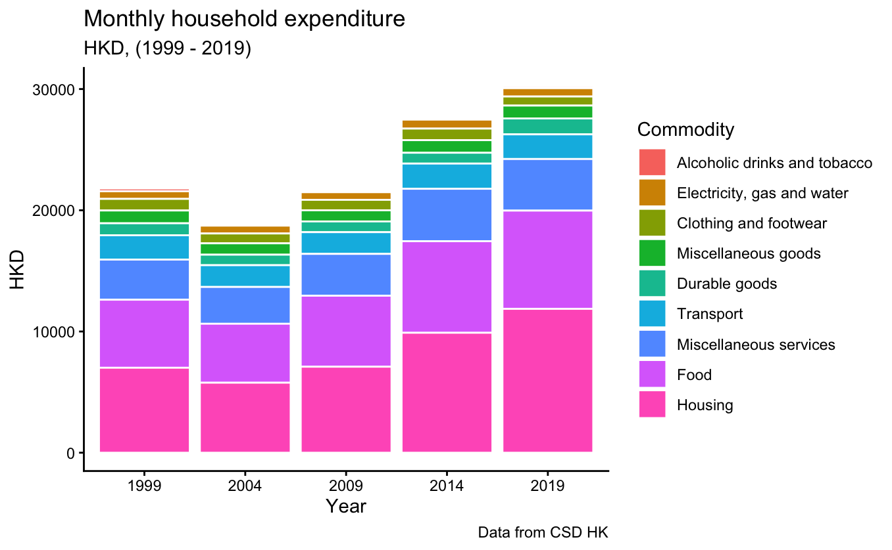

# Note-#Household

Date: March 17, 2026
Lecture: Research

[ECON4200 (1)](https://www.notion.so/ECON4200-1-33a68f846c7f81ada5f8f859cdff8832?pvs=21)

### 📝 Summary

- Key Takeaways:
- Keywords:
- Important Subjects:

---

## Household expenditure

- Period
    - 1999-2019
- Description
    - By commodity
    - By housing group

### Insights

1. Abs expenditure dropped at 2004 (SARS?), then increased
    1. Most goods exhibit similar pattern
    2. Except Transport, Clothing, Alcohol & Tobacco decreased
2. Top 2 goods are Housing and Food, 55-65% of total expenditure; Next are Services and Transport, 24-20%
    1. Housing, Food increasing share, 2.5% and 6% respectively
    2. Share of other goods decreased
        1. Durables, Services, Electricity increased in abs terms, shares is compressed by increased denominator (Housing and Food)
3. Cost of inelastic consumption increased
    1. Housing, Food, Durable, Electricity
    2. Except Transport (subsidised?)
    3. Involuntary or not?
        1. Preference change or increased costs?

## Aggregate

### Absolute expenditure

| **Monthly household expenditure** | 1999 | 2004 | 2009 | 2014 | 2019 |
| --- | --- | --- | --- | --- | --- |
| Alcoholic drinks and tobacco | 226 | 152 | 133 | 151 | 157 |
| Electricity, gas and water | 631 | 646 | 630 | 740 | 688 |
| Clothing and footwear | 958 | 812 | 861 | 955 | 748 |
| Miscellaneous goods | 1053 | 937 | 920 | 1038 | 1062 |
| Durable goods | 988 | 868 | 886 | 892 | 1312 |
| Transport | 2009 | 1793 | 1792 | 2081 | 2033 |
| Miscellaneous services | 3310 | 3037 | 3449 | 4323 | 4257 |
| Food | 5612 | 4863 | 5859 | 7554 | 8107 |
| Housing | 7009 | 5775 | 7093 | 9894 | 11865 |

### Shares of total expenditure

| **Share of monthly household expenditure** | 1999 | 2004 | 2009 | 2014 | 2019 |
| --- | --- | --- | --- | --- | --- |
| Alcoholic drinks and tobacco | 1.04 | 0.80 | 0.62 | 0.55 | 0.52 |
| Electricity, gas and water | 2.90 | 3.42 | 2.91 | 2.68 | 2.28 |
| Clothing and footwear | 4.40 | 4.30 | 3.98 | 3.46 | 2.47 |
| Miscellaneous goods | 4.83 | 4.96 | 4.25 | 3.76 | 3.51 |
| Durable goods | 4.53 | 4.60 | 4.10 | 3.23 | 4.34 |
| Transport | 9.22 | 9.50 | 8.29 | 7.53 | 6.73 |
| Miscellaneous services | 15.19 | 16.08 | 15.95 | 15.65 | 14.08 |
| Food | 25.75 | 25.75 | 27.10 | 27.34 | 26.82 |
| Housing | 32.16 | 30.58 | 32.80 | 35.81 | 39.25 |

### Nominal vs real

| **Real household expenditure** | 1999 | 2004 | 2009 | 2014 | 2019 |
| --- | --- | --- | --- | --- | --- |
| Alcoholic drinks and tobacco | 2.26 | 1.45 | 1.12 | 0.94 | 0.92 |
| Electricity, gas and water | 6.31 | 6.06 | 8.03 | 6.09 | 5.26 |
| Clothing and footwear | 9.58 | 9.07 | 8.71 | 8.40 | 6.98 |
| Miscellaneous goods | 10.53 | 8.50 | 7.35 | 7.30 | 7.00 |
| Durable goods | 9.88 | 11.39 | 14.21 | 16.79 | 29.80 |
| Transport | 20.09 | 17.82 | 17.20 | 17.43 | 15.88 |
| Miscellaneous services | 33.10 | 32.08 | 35.32 | 38.17 | 34.60 |
| Food | 56.12 | 51.43 | 51.45 | 52.61 | 47.51 |
| Housing | 70.09 | 76.19 | 81.06 | 87.53 | 89.05 |

## By housing type

### All commodities

| **Monthly household expenditure** | 1999 | 2004 | 2009 | 2014 | 2019 |
| --- | --- | --- | --- | --- | --- |
| Public housing | 12842 | 10482 | 10569 | 13276 | 15018 |
| Subsidised housing | 22168 | 17458 | 19287 | 26073 | 27630 |
| Private housing | 27238 | 23919 | 28716 | 36729 | 37896 |

### Absolute expenditure

| **Monthly household expenditure** |  | 1999 | 2004 | 2009 | 2014 | 2019 |
| --- | --- | --- | --- | --- | --- | --- |
| Public housing | Alcoholic drinks and tobacco | 273 | 185 | 151 | 177 | 175 |
| Public housing | Electricity, gas and water | 566 | 550 | 512 | 645 | 575 |
| Public housing | Clothing and footwear | 662 | 466 | 483 | 529 | 525 |
| Public housing | Miscellaneous goods | 743 | 610 | 574 | 664 | 840 |
| Public housing | Durable goods | 638 | 468 | 397 | 380 | 824 |
| Public housing | Transport | 1280 | 970 | 897 | 1049 | 1037 |
| Public housing | Miscellaneous services | 2063 | 1583 | 1609 | 2065 | 2185 |
| Public housing | Food | 5044 | 4035 | 4786 | 6159 | 7080 |
| Public housing | Housing | 1573 | 1615 | 1160 | 1608 | 1777 |
| Subsidised housing | Alcoholic drinks and tobacco | 164 | 143 | 117 | 131 | 126 |
| Subsidised housing | Electricity, gas and water | 668 | 680 | 635 | 749 | 678 |
| Subsidised housing | Clothing and footwear | 954 | 690 | 685 | 873 | 631 |
| Subsidised housing | Miscellaneous goods | 1125 | 863 | 828 | 939 | 1101 |
| Subsidised housing | Durable goods | 1151 | 742 | 647 | 751 | 1130 |
| Subsidised housing | Transport | 1951 | 1538 | 1397 | 1636 | 1616 |
| Subsidised housing | Miscellaneous services | 3283 | 2708 | 2617 | 3449 | 3343 |
| Subsidised housing | Food | 5772 | 5020 | 5832 | 7739 | 7821 |
| Subsidised housing | Housing | 7100 | 5074 | 6529 | 9806 | 11184 |
| Private housing | Alcoholic drinks and tobacco | 219 | 138 | 129 | 143 | 158 |
| Private housing | Electricity, gas and water | 660 | 684 | 694 | 793 | 742 |
| Private housing | Clothing and footwear | 1143 | 1042 | 1138 | 1237 | 881 |
| Private housing | Miscellaneous goods | 1222 | 1139 | 1148 | 1294 | 1154 |
| Private housing | Durable goods | 1149 | 1129 | 1250 | 1246 | 1585 |
| Private housing | Transport | 2482 | 2328 | 2442 | 2849 | 2601 |
| Private housing | Miscellaneous services | 4094 | 3939 | 4793 | 5967 | 5451 |
| Private housing | Food | 5910 | 5253 | 6475 | 8324 | 8654 |
| Private housing | Housing | 10359 | 8267 | 10647 | 14876 | 16670 |

### Shares of total expenditure

| **Share of monthly household expenditure** |  | 1999 | 2004 | 2009 | 2014 | 2019 |
| --- | --- | --- | --- | --- | --- | --- |
| Public housing | Alcoholic drinks and tobacco | 2.13 | 1.76 | 1.43 | 1.33 | 1.17 |
| Public housing | Electricity, gas and water | 4.41 | 5.25 | 4.84 | 4.86 | 3.83 |
| Public housing | Clothing and footwear | 5.15 | 4.45 | 4.57 | 3.98 | 3.50 |
| Public housing | Miscellaneous goods | 5.79 | 5.82 | 5.43 | 5.00 | 5.59 |
| Public housing | Durable goods | 4.97 | 4.46 | 3.76 | 2.86 | 5.49 |
| Public housing | Transport | 9.97 | 9.25 | 8.49 | 7.90 | 6.91 |
| Public housing | Miscellaneous services | 16.06 | 15.10 | 15.22 | 15.55 | 14.55 |
| Public housing | Food | 39.28 | 38.49 | 45.28 | 46.39 | 47.14 |
| Public housing | Housing | 12.25 | 15.41 | 10.98 | 12.11 | 11.83 |
| Subsidised housing | Alcoholic drinks and tobacco | 0.74 | 0.82 | 0.61 | 0.50 | 0.46 |
| Subsidised housing | Electricity, gas and water | 3.01 | 3.90 | 3.29 | 2.87 | 2.45 |
| Subsidised housing | Clothing and footwear | 4.30 | 3.95 | 3.55 | 3.35 | 2.28 |
| Subsidised housing | Miscellaneous goods | 5.07 | 4.94 | 4.29 | 3.60 | 3.98 |
| Subsidised housing | Durable goods | 5.19 | 4.25 | 3.35 | 2.88 | 4.09 |
| Subsidised housing | Transport | 8.80 | 8.81 | 7.24 | 6.27 | 5.85 |
| Subsidised housing | Miscellaneous services | 14.81 | 15.51 | 13.57 | 13.23 | 12.10 |
| Subsidised housing | Food | 26.04 | 28.75 | 30.24 | 29.68 | 28.31 |
| Subsidised housing | Housing | 32.03 | 29.06 | 33.85 | 37.61 | 40.48 |
| Private housing | Alcoholic drinks and tobacco | 0.80 | 0.58 | 0.45 | 0.39 | 0.42 |
| Private housing | Electricity, gas and water | 2.42 | 2.86 | 2.42 | 2.16 | 1.96 |
| Private housing | Clothing and footwear | 4.20 | 4.36 | 3.96 | 3.37 | 2.32 |
| Private housing | Miscellaneous goods | 4.49 | 4.76 | 4.00 | 3.52 | 3.05 |
| Private housing | Durable goods | 4.22 | 4.72 | 4.35 | 3.39 | 4.18 |
| Private housing | Transport | 9.11 | 9.73 | 8.50 | 7.76 | 6.86 |
| Private housing | Miscellaneous services | 15.03 | 16.47 | 16.69 | 16.25 | 14.38 |
| Private housing | Food | 21.70 | 21.96 | 22.55 | 22.66 | 22.84 |
| Private housing | Housing | 38.03 | 34.56 | 37.08 | 40.50 | 43.99 |

---

### ✅To-Dos

- 
-